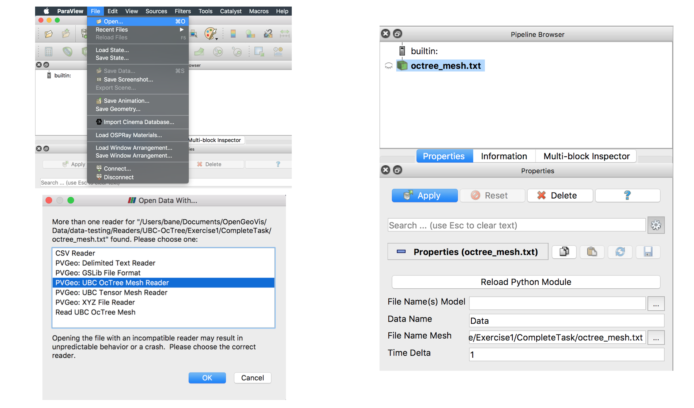

# About Examples
`PVGeo` is a python module we are developing to contain the bulk of our code for file readers, filters, and other algorithms. *PVGeo* is deployed in various sub-packages called *suites*. These *suites* consist of a set of reader, filter, source, or writer algorithms (or any combination of those) for a general area of geoscientific processing and visualization.

Take a look at the navigation pane to the left to explore the different suites in their drop down menu. Each feature (reader, filter, etc.) has its own page where you can find an overview of that feature, an example of how to use it directly in ParaView, and an example on how to use it in a standard Python environment.

For example specific questions, concerns, or insights, please leave a comment at the bottom of that example's page for other users to find. If you think there may be a serious problem with an example, please open an issue on the [**issues page**](https://github.com/OpenGeoVis/PVGeo/issues) so that we can promptly fix it.

---
## Typical Usage
All algorithms deployed in *PVGeo* are useable in the following manners in a Python environment where the algorithm can be called and instantiated with keyword arguments for its parameters and then applied on some input data set.

```py
import PVGeo
# PSEUDOCODE: Typical use of a PVGeo algorithm:
output = PVGeo.suite.Algorithm(**kwargs).Apply(input)
```

Or we can instantiate the algorithm for repetitive calls if, for example, we need to request varying time steps.
```py
import PVGeo
# PSEUDOCODE: Typical use of a PVGeo algorithm:
alg = PVGeo.suite.Algorithm(**kwargs)
# Grab the output data object
output = alg.Apply(input)
# Update the output to a desired time step
alg.UpdateTimeStep(6.0)
```

---

## Reader Algorithms
A reader takes data from files and puts them into the proper VTK and ParaView data structures so that we can visualize that data on the VTK or ParaView pipeline. ParaView comes with a plethora of native data format readers but there are still many more formats in the geosciences that have not been implemented. By creating formats for common geoscientific formats, we hope to make the process of getting data into the ParaView pipeline as simple as possible.


### ParaView Usage
The *PVGeo* readers aren't directly available in the GUI menus of ParaView but rather a dialog will appear for you to select the desired file reader when selecting **File -> Open...** within ParaView like the image below:




### Python Usage

The file readers in *PVGeo* are available for use in the same manner as all algorithms in *PVGeo*. Readers are typically used in a manner that allows the reader algorithm to be repetitively called to request various time steps:

```py
import PVGeo
# PSEUDOCODE: Typical use of a PVGeo reader:
reader = PVGeo.suite.Reader(**kwargs)
reader.AddFileName(['file%.2d' % i for i in range(20)])

# Grab the output data object
output = reader.Apply() # NOTE: Readers have no input for the `Apply()` call

# Update the output to a desired time step
reader.UpdateTimeStep(6.0)
```

It is worth noting that if you have only one file (one time step) to read, then readers can be used to immediately produce a data object:

```py
import PVGeo
# PSEUDOCODE: Typical use of a PVGeo reader:
output = PVGeo.suite.Reader(fileName='fname.txt', **kwargs).Apply()
```

---

## Filter Algorithms
A filter modifies, transforms, combines, analyses, processes, etc. data in VTK data structures on either a VTK or ParaView pipeline. Filters provide a means for changing how we visualize data or create a means of generating topology for an input data source to better represent that data in a 3D rendering environment.
For example, we have developed a filter called [***Voxelize Points***](filters-general/voxelize-points.md) which takes a set of scattered points sampled on a rectilinear reference frame and generates voxels for every point such that the volume of data made by the points is filled with topologically connected cells.
Or for another filter, maybe we might have a series of scattered points that we know represent the center of a tunnel or tube that represents a well. We can use a filter to transform those points into a connected line that we then construct a cylinder around. This allows us to save out minimal data (just XYZ points as opposed to complex geometries that make up the tunnel) to our hard drive while still having complex visualizations from that data.

### ParaView Usage

Within ParaView, filters are available for selection directly from the GUI menus when an input data source is selected on the pipeline. All of the *PVGeo* filters are available under their own categories in the **Filters** menu.  

### Python Usage

Filters are typically used in a manner that parameters are set and an input data set is provided to immediately produce an output. The parameters/options of the filter are set via the `**kwargs` upon construction and the input(s) is/are given to the `Apply()` call:

```py
import PVGeo
# PSEUDOCODE: Typical use of a PVGeo filter:
output = PVGeo.suite.Filter(**kwargs).Apply(input)
```

```py
import PVGeo
# PSEUDOCODE: Typical use of a PVGeo filter with multiple inputs:
output = PVGeo.suite.Filter(**kwargs).Apply(input0, input1)
```

It is also worth noting that filter algorithms can be used as their own entities to make repetitive calls on them much like we showed with readers:

```py
import PVGeo
# PSEUDOCODE: Typical use of a PVGeo filter:
filt = PVGeo.suite.Filter(**kwargs)
output = filt.Apply(input)

# Change a parameter of the filter
filt.SetParameter(True) # PSEUDOCODE
filt.Update() # Make sure to update the output after changing a parameter

# Request a different time step
filt.UpdateTimeStep(6.0)

```


---
## Source Algorithms
A source takes input parameters from a user and generates a data object for visualization or export. In *PVGeo*, we have implemented the *Model Building* suite with many sources that allow for a user to specify attributes of a data set such as a model discretization and have a data source appear in the rendering environment alongside their other data for that scene.

### ParaView Usage

Within ParaView, sources are available for selection directly from the GUI menus. All of the *PVGeo* sources are available under their own categories in the **Sources** menu.  


### Python Usage
Sources can be used like any algorithm in *PVGeo* and are typically called to immediately produce an output like below:

```py
import PVGeo
# PSEUDOCODE: Typical use of a PVGeo source:
output = PVGeo.suite.Source(**kwargs).Apply()
```


---
## Writer Algorithms
These features have not yet been deployed but they will enable users to save data from VTK data structures in ParaView to common geoscientific data formats.
