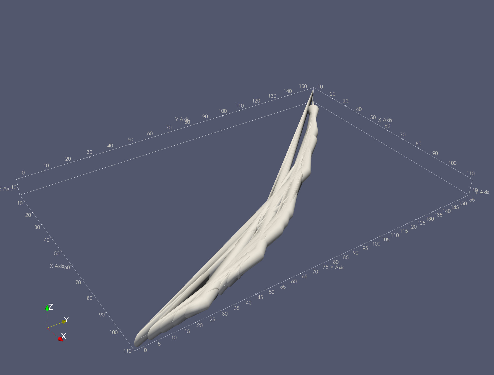
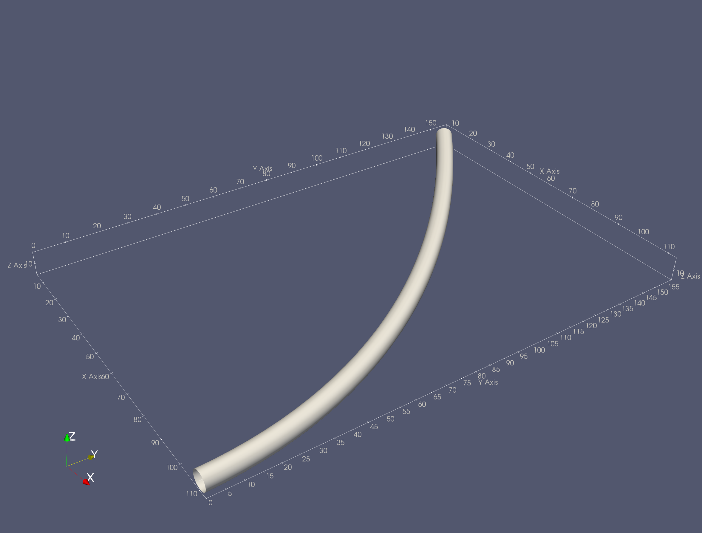

!!! info
    This example will demonstrate how to to build a tube from a set of points in `vtkPolyData`.

## Overview

Takes points from a `vtkPolyData` object and constructs a line of those points then builds a polygonal tube around that line with some specified radius and number of sides.

## ParaView Example

First, lets generate some data on the ParaView pipeline. For this example, we want to generated a series of scattered points that might make up a path using a **Programmable Source**. Select *Sources->Alphabetical->Programmable Source* then paste the following script in the source's *Script* field:

```py
import numpy as np
from PVGeo import pointsToPolyData

def path1(y):
    """Equation: x = a(y-h)^2 + k"""
    a = - 110.0 / 160.0**2
    x = a*y**2 + 110.0
    idxs = np.argwhere(x>0)
    return x[idxs][:,0], y[idxs][:,0]

x, y = path1(np.arange(0.0, 200.0, 25.0))
zo = np.linspace(9.0, 11.0, num=len(y))
coords = np.vstack((x,y,zo)).T
# Shuffle points to demonstrate value of Nearest Neighbor
np.random.shuffle(coords)

pdo = self.GetOutput()
pdo.ShallowCopy(pointsToPolyData(coords))
```

!!! note
    These points are similar to the points used in the file given with the [Many Slices Along Points Example](./many-slices-along-points.md) except we shuffle them to make use of the nearest neighbor approximation.


### Apply the Filter

Now that you have the points generated on the pipeline, lets go ahead and apply the **Points to Tube** filter from *Filters->PVGeo: General Filters->Points to Tube*. Change the radius to 3 and go ahead and click *Apply*. The output data should look really wacky and incorrectly built like the image below; this is good.



Remember that in the script given above we shuffle the points to demonstrate that the points make a useable line but we need to reconstruct the order of the points. We do this by selecting the *Use Nearest Nbr Approx* checkbox; this will ensure that a useable path is generate from the points. Go ahead and select the check box then reapply the filter. Now it looks good (see image below)!



## Python Example

!!! info "{lookup:PVGeo.filters.poly.PointsToTube}"

```py
import numpy as np
from PVGeo import pointsToPolyData, PointsToTube


############################################
######### GENERATE SOME POINT DATA #########

def path1(y):
    """Equation: x = a(y-h)^2 + k"""
    a = - 110.0 / 160.0**2
    x = a*y**2 + 110.0
    idxs = np.argwhere(x>0)
    return x[idxs][:,0], y[idxs][:,0]

x, y = path1(np.arange(0.0, 200.0, 25.0))
zo = np.linspace(9.0, 11.0, num=len(y))
coords = np.vstack((x,y,zo)).T
# Shuffle points to demonstrate value of Nearest Neighbor
np.random.shuffle(coords)

# Make a VTK data object for the filter to use
vtkPoints = pointsToPolyData(coords)

############################################

# Use the filter: here is vtkPolyData containing the connected line
tube = PointsToTube(nearestNbr=True).Apply(vtkPoints)

print(tube)
```
