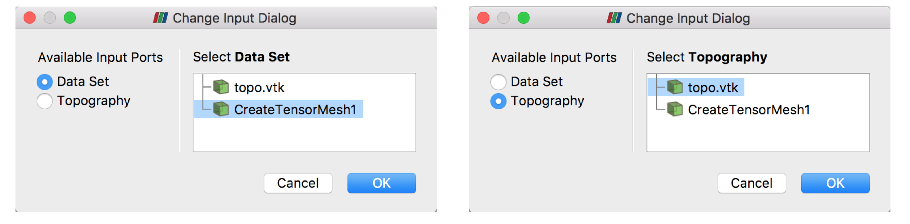

!!! info
    This example will demonstrate how to add a cell data field to an input data set that defines whether that cell should be active. The activity of the cell is determined by whether it is beneath and input topography surface.

## Overview
This filter adds a new cell data field to an input data source defining whether that cell is beneath some input topography surface.

??? question "Why add a cell data field?"
    We add a cell data field to the input data set as this allows us to use a wide range of input data types. We also add this data array as it will enable users to create model discretizations within ParaView for export to external processing software that need the entire model discretization with an active cells field.


## ParaView Example

<iframe src="https://player.vimeo.com/video/281725448" width="640" height="400" frameborder="0" webkitallowfullscreen mozallowfullscreen allowfullscreen></iframe>
<p><a href="https://vimeo.com/281725448">PVGeo: Extract Topography Filter</a> from <a href="https://vimeo.com/user82050125">Bane Sullivan</a> on <a href="https://vimeo.com">Vimeo</a>.</p>

First, lets generate some data on the ParaView pipeline. For this example, we need a topography data set and an input grid data set.

{btn:https://dl.dropbox.com/s/gw5v3tiq68oge3l/Example-Extract-Topo.zip?dl=0}

??? example "Data Description"
    Data File: 'topo.vtk'

    - **Description:** This data file is has a `vtkPolyData` topography surface we can use.

For the grid data set, let's use one of the Model Building sources: *Sources->PVGeo: Model Building->Create Tensor Mesh* with the following parameters:

- Origin: `[793000, 9192500, 2690]`
- X Cells: `1000 500 50*250 500 1000`
- Y Cells: `1000 500 55*250 500 1000`
- Z Cells: `30*100.0 5*250.0 500`


Now we have an input data set that we wish to extract beneath the topography surface shown in the rendering below:

!!! info "The Input Data"
    <div style="position: relative; padding-bottom: 56.25%; height: 0; overflow: hidden; max-width: 100%; height: auto;">
            <iframe src="http://viewer.pvgeo.org/?fileURL=https://dl.dropbox.com/s/lux1818qjf3lxrp/extract-topo-before.vtkjs?dl=0" frameborder="0" allowfullscreen style="position: absolute; top: 0; left: 0; width: 100%; height: 100%;"></iframe>
    </div>


### Apply the Filter

Now that you have the topography and a grid data set on the pipeline, let's go ahead and use the **Extract Topography** filter: *Filters->PVGeo: General Grids->Extract Topography*. Be sure to properly select the input data sets in the pop-up dialog like the image below:



After selecting the proper inputs, click **OK** then **Apply** and find the output data object on the pipeline. Select the output and change the display coloring to the new **Active Topography** cell field. This will show the cells that are active underneath the topography surface (0 for above surface and 1 for below surface). Now we can threshold this gridded data set to remove parts of the model that are above the topography surface by applying a *Threshold* filter native to ParaView and chopping out all values below 1.

The resulting grid with cells above the topography extracted will look like the rendering below:

!!! success "Example"
    <div style="position: relative; padding-bottom: 56.25%; height: 0; overflow: hidden; max-width: 100%; height: auto;">
            <iframe src="http://viewer.pvgeo.org/?fileURL=https://dl.dropbox.com/s/nsbwcrafl5v1gas/extract-topo.vtkjs?dl=0" frameborder="0" allowfullscreen style="position: absolute; top: 0; left: 0; width: 100%; height: 100%;"></iframe>
    </div>


## Python Example

Take a look at `ExtractTopography`'s code docs [here](http://docs.pvgeo.org/en/latest/suites/Grid-Tools.html#PVGeo.grids.ExtractTopography).

!!! failure "Description to come!"
    There are a lot of pages in the documentation and we are trying to fill all content as soon as possible. Stay tuned for updates to this page

<!---
```py
import numpy as np
from PVGeo.filters import PointsToPolyData
from PVGeo.grids import CreateTensorMesh, ExtractTopography


############################################
######### GENERATE SOME INPUT DATA #########


############################################

# Use the filter:

```

TODO --->
