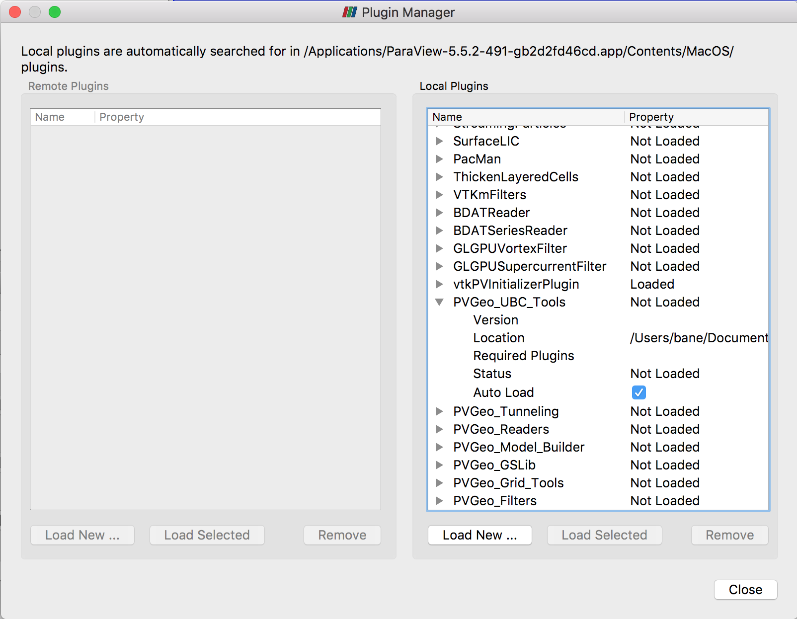

!!! info
    If you have an idea for a macro, plugin, or would like to see how we would address a geoscientific visualization problem with ParaView, please post your thoughts on the [**issues page**](https://github.com/OpenGeoVis/PVGeo/issues) or get involved with the *PVGeo* community on Slack to discuss adding new features: <script async defer src="http://slack.pvgeo.org/slackin.js"></script>

## A Brief Introduction to ParaView

ParaView is an open-source platform that can visualize 2D, 3D, and 4D (time-varying) datasets. ParaView can process multiple very large data sets in parallel then later collect the results to yield a responsive graphics environment with which a user can interact. The better the processor and graphics hardware the machine or machines hosting the software, the faster and better ParaView will run. However, it can run quite well on a laptop with a standard graphics card such as a MacBook Pro.

Since ParaView is an open source application, anyone can download the program and its source code for modifications. The easiest way to get started with ParaView is to download the compiled binary installers for your operating system from [**here**](https://www.paraview.org/download/).

For further help, check out the [documentation](https://www.paraview.org/documentation/) provided by Kitware. In particular, the two worth looking through for a quick tour of ParaView are the **The ParaView Guide** and **The ParaView Tutorial.** One is a tutorial of the ParaView software and shows the user how to create sources, apply filters, and more. The other is a guide on how to do scripting, macros, and more intense use of the application.

### Install ParaView

!!! warning
    This will only work for ParaView version 5.5.3 and above! But wait... version 5.5.3 does not exist yet! You must download the **nightly-build** version of ParaView [found here](https://www.paraview.org/download/)

Open the downloaded installer from [**ParaView's website**](https://www.paraview.org/download/) and follow the prompts with the installer.

Tour around software:
Take a look at Section 2.1 of **The ParaView Tutorial** for details of the application’s GUI environment. Chapter 2 of the tutorial as a whole does an excellent job touring the software and its workflow for those unfamiliar with the software and its general capabilities.


??? tip "Tip: State Files"
    One convenient feature is to save the state of the ParaView environment. This saves all the options you selected for all the filters you applied to visualize some data. Select *File->Save State…* (*Note:* this saves the absolute path of the files loaded into ParaView, so be sure to select *Search for Files Under Directory...* when opening these state files).


----------


## Install *PVGeo*

We highly recomend using Anaconda to manage you python virtual environments and we know installation via Anaconda python distrubutions will work on Mac, Windows, and Linux operating systems. To begin using the *PVGeo* python package, create a new virtual environment and install *PVGeo* through pip.

```bash
$ conda create -n PVGeoEnv python=2.7

# Install vtk through conda as this is OS-independent
$ conda install -n PVGeoEnv vtk
```

```bash
$ source activate PVGeoEnv
(PVGeoEnv) $ pip install PVGeo
```

Test the install (non-Windows):
```bash
(PVGeoEnv) $ python -m PVGeo test
```

### Installing to ParaView

To use the *PVGeo* library as plugins in ParaView, we must link the virtual environment that you installed *PVGeo* to ParaView's python environment and load a series of plugin files that wrap the *PVGeo* code base with ParaView's Graphical User Interface.


#### Linking *PVGeo*
First, lets link *PVGeo*'s virtual environment to ParaView by setting up a `PYTHONPATH` and a `PV_PLUGIN_PATH` environmental variables. First, retrieve the needed paths from *PVGeo*. Do this by executing the following from your command line:

```bash
(PVGeoEnv) $ python -m PVGeo install
```

!!! warning "You Should Upgrade ParaView's NumPy"
    Unfortunately, ParaView ships with a very old version of NumPy by default (v1.8.1) and PVGeo requires NumPy v1.10.x or later. Until ParaView upgrades its NumPy version, you must go into ParaView's application contents, delete NumPy, and create a new symbolic link to the NumPy installed in the `PVGeoEnv` virtual environment.

    If you do not do this, some algorithms will crash ParaView when used or some I/O opertions might be a bit slow.

    **Steps:**

    1. Locate your installation of ParaView (`/Applications/ParaView 5.5.xxx/Contents` or `C:\Program Files\ParaView 5.5.xxxx\`)
    2. Navigate to the local Python site-packages:
        - Mac: `.../Contents/Python`
        - Windows: `...\bin\Lib\site-packages\`
    3. Delete the local version of NumPy (the `numpy` directory)
    4. Use the PYTHONPATH variable from the above code to find the NumPy installed along PVGeo.
    5. Create a shortcut or symbolic link for numpy within ParaView's python site-packages to the numpy folder in `PVGeoEnv`'s site-packages

That script will output the paths you need to set in the environmental variables moving forward. If you are on a Mac OS X computer then that script will output a shell command for you to execute for the install. If you are on a Mac, execute that command and skip to [Loading the Plugins](#loading-the-plugins)

Setting up environmental variables is a bit involved for Windows. First you need to open **Control Center** and search for **Advanced system settings**. Click **Environment variables**. In the section **User variables for Name** add the following variable by clicking **New...**:

- Variable Name: `PV_PLUGIN_PATH` then copy/paste the `PV_PLUGIN_PATH` output from above.

Now we need to edit the `PYTHONPATH` variable that should already exist in your environment. This can get messy/tricky so please strictly follow these instructions:

1. Copy the `PYTHONPATH` output from above.

2. Edit the `PYTHONPATH` variable by selecting it then click **Edit...**.

3. Pay attention to what that path currently is because we need to **prepend** it. For example, your path might currently be `c:\python27\lib\site-packages`. Simply prepend this path by pasting the `PYTHONPATH` variable at the beginning, then typing a semicolon (;).

4. Now test that the install worked by opening ParaView (close it and reopen if needed). Open the **Python Shell** and import the modules delivered in this repo by executing `import PVGeo` and `import pvmacros`. Errors should not arise but if they do, post to the [**issues page**](https://github.com/OpenGeoVis/PVGeo/issues) and the errors will be *immediately* addressed.


#### Loading the Plugins

Now you must load the plugin files through ParaView's Plugin Manager. Select *Tools -> Manage Plugins* then select *Load New* on the bottom right of the popup dialog. Navigate to the directory declared in `PV_PLUGIN_PATH` and load each of the `.py` files. Once the files are loaded, expand them in the plugin manager and be sure to select *Auto Load*.

 <!-- .element width="50%" -->

Now test that the install worked by ensuring the various categories for the PVGeo filters are in the **Filters** menu such as **PVGeo General Filters**. Errors should not arise but if they do, post to the [**issues page**](https://github.com/OpenGeoVis/PVGeo/issues) and the errors will be *immediately* addressed.


!!! help
    If an error arises or you are having trouble, feel free to join the *PVGeo* community on Slack and ask for help: <script async defer src="http://slack.pvgeo.org/slackin.js"></script>

    You can also post to the [**issues page**](https://github.com/OpenGeoVis/PVGeo/issues) if you think you are encountering a bug.


### Update *PVGeo*

```bash
(PVGeoEnv) $ pip install --upgrade PVGeo
```


--------------

## Using Outside Modules
If you installed *PVGeo* according to the instructions above, then any python package installed through pip in that virtual environment will be accessible in ParaView. For some further reading on using virtual environments with ParaView, see [this blog post](https://blog.kitware.com/using-pvpython-and-virtualenv/)
