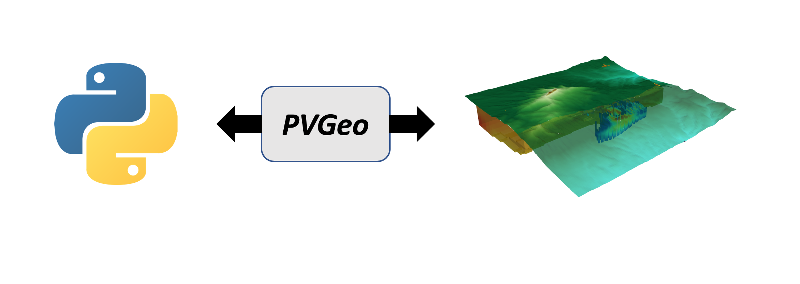

# AGU 2018 Poster & Lightning Talk

Are you attending AGU this year and eager to learn more about PVGeo and other
open-source software in the geosciences? Then be sure to check out the two sessions
on Friday for a
[**A Tour of Open-Source Software Packages for the Geosciences**](https://agu.confex.com/agu/fm18/meetingapp.cgi/Session/56864)!

We thought the best way to share our poster and lightning talk would be in the form
of a dynamic webpage where people can stop by, interact with the visualizations,
and download code to do it themselves!

## The Poster

First and foremost, here's the poster (click to enlarge)!


<style>
/* Style the Image Used to Trigger the Modal */
#aguImg {
  border-radius: 5px;
  cursor: pointer;
  transition: 0.3s;
}

#aguImg:hover {opacity: 0.7;}

/* The Modal (background) */
.modal {
  display: none; /* Hidden by default */
  position: fixed; /* Stay in place */
  z-index: 1; /* Sit on top */
  padding-top: 100px; /* Location of the box */
  left: 0;
  top: 0;
  width: 100%; /* Full width */
  height: 100%; /* Full height */
  overflow: auto; /* Enable scroll if needed */
  background-color: rgb(0,0,0); /* Fallback color */
  background-color: rgba(0,0,0,0.9); /* Black w/ opacity */
}

/* Modal Content (Image) */
.modal-content {
  margin: auto;
  display: block;
  width: 80%;
  max-width: 700px;
}

/* Caption of Modal Image (Image Text) - Same Width as the Image */
#caption {
  margin: auto;
  display: block;
  width: 80%;
  max-width: 700px;
  text-align: center;
  color: #ccc;
  padding: 10px 0;
  height: 150px;
}

/* Add Animation - Zoom in the Modal */
.modal-content, #caption {
  animation-name: zoom;
  animation-duration: 0.6s;
}

@keyframes zoom {
  from {transform:scale(0)}
  to {transform:scale(1)}
}

/* The Close Button */
.modal_close {
  position: absolute;
  top: 10%;
  right: 35px;
  color: #f1f1f1;
  font-size: 40px;
  font-weight: bold;
  transition: 0.3s;
}

.modal_close:hover,
.modal_close:focus {
  color: #bbb;
  text-decoration: none;
  cursor: pointer;
}

/* 100% Image Width on Smaller Screens */
@media only screen and (max-width: 700px){
  .modal-content {
    width: 100%;
  }
}
</style>


<!-- Trigger the Modal -->


<!-- The Modal -->
<div id="aguModal" class="modal">

  <!-- The Close Button -->
  <span class="modal_close">&times;</span>

  <!-- Modal Content (The Image) -->
  

  <!-- Modal Caption (Image Text) -->
  <div id="caption"></div>
</div>

<script>
// Get the modal
var modal = document.getElementById('aguModal');

// Get the image and insert it inside the modal - use its "alt" text as a caption
var img = document.getElementById('aguImg');
var modalImg = document.getElementById("imgAGU");
var captionText = document.getElementById("caption");
img.onclick = function(){
  modal.style.display = "block";
  modalImg.src = this.src;
  captionText.innerHTML = this.alt;
}

// Get the <span> element that modal_closes the modal
var span = document.getElementsByClassName("modal_close")[0];

// When the user clicks on <span> (x), modal_close the modal
span.onclick = function() {
  modal.style.display = "none";
}
</script>


-----

## The Lightning Talk


!!! info
    This section of the page was developed for a 5 minute lightning talk
    during the 2018 AGU session: [**A Tour of Open-Source Software Packages for the Geosciences**](https://agu.confex.com/agu/fm18/meetingapp.cgi/Session/56864).


### Moving Towards Visualization

Typically, the 3D/4D aspects of visualization routines are separated from
the processing code and software. This often requires researchers to convert
their working data to other formats, creating static copies of their data files.
Having static conversions of data can lead to messy working directories and
trouble managing outdated data files, especially on larger projects.
To mitigate this, we present PVGeo as tool to work towards dynamically linking
processing to visualization, such that visualization becomes both a part of
the routine for the researcher as well as a tool for post processing analysis
and communication of findings.




### What is PVGeo?

- **Python** package at its core for 3D/4D geovisualization.
- Create compelling and **integrated visualizations**.
- Built upon **VTK**, a scalable and well-maintained visualization library.
- Extends geovisualization into **ParaView**, **VTK.js**, and **Virtual Reality**.
- **Open-source**: contribute on [GitHub](https://github.com/OpenGeoVis/PVGeo)


??? abstract
    PVGeo is an open-source Python package for geoscientific visualization and analysis, harnessing an already powerful software platform: the Visualization Toolkit (VTK) and its front-end application, [ParaView](http://paraview.org). The VTK software platform is well-maintained, contains an expansive set of native functionality, and provides a robust foundation for scientific visualization, yet the development of tools compatible for geoscience data and models has been limited. As a software extension package to VTK and ParaView, PVGeo addresses the lack of geoscientific compatibility by creating a framework for geovisualization. This framework is a set of tools for visually integrating geoscience data and models directly within ParaView's graphical user interface, simplifying the required routines to make compelling visualizations of geoscientific datasets. PVGeo aims to make the process of importing data into ParaView simple and fluid for users while providing a guide for contributions avoiding the typical, ambitious programming endeavor of building ParaView plugins. The PVGeo package is available for download on PyPI (`pip install PVGeo`), [documented online](http://pvgeo.org), and [open-source on GitHub](https://github.com/OpenGeoVis/PVGeo) for community-driven development.


### PVGeo Resources

- [Brief demo page](http://demo.pvgeo.org)
- [Slack community](http://slack.pvgeo.org)
- [The code](https://github.com/OpenGeoVis/PVGeo)
- [Use examples in ParaView](../examples/about-examples.md)
- [Nitty gritty code docs](http://docs.pvgeo.org)
- [Vimeo video examples](https://vimeo.com/user82050125)


### What does PVGeo look like in ParaView?

PVGeo is built for direct use within ParaView, leveraging brand new features
in ParaView for Python based plugins that can leverage ParaView's powerful
graphical user interface.

To learn more about what PVGeo looks like within ParaView, check out the
videos on the [**About Examples Page**](../examples/about-examples.md) or
other videos throughout the examples which are all posted to our
[**Vimeo Account**](https://vimeo.com/user82050125).


### What about directly in Python environments?

Yes! PVGeo is built to work in both Python 2 and 3 across operating systems.
Once PVGeo and [**VTK**](https://pypi.org/project/vtk/) are installed to your
active environment you can get to
work using PVGeo directly in your workflows for analysis, data integration,
and visualization!

```py
import PVGeo
```

To learn more about using PVGeo in your Python environment, check out the
psuedo-code on the [**About Examples Page**](../examples/about-examples.md)


### Want to make PVGeo interoperable with another library?

Let's do it!! You can easily extend PVGeo by diving into the source code and
adding new algorithms or even entire new suites! Or simpler, you could create
a plugin file that gets installed adjacent to your library that leverages
PVGeo.

For example, say your library has some spectacular file IO code or you can
predefine processing routines in parameter files; then create a file reader
algorithm that extends one of PVGeo's many base classes to parse your input
data/parameter file, leverage your library for the work, then sends the results
to ParaView for immediate visualization.

??? abstract "But How?"
    Easy! Just create a new reader algorithm and place it in a `.py` file like this one
    we built for [`discretize`](http://discretize.simpeg.xyz/en/latest/):

    ```py
    # Import PVGeo for all its awesome super classes
    from PVGeo import InterfacedBaseReader
    from PVGeo import _helpers
    # Import the library you wish to leverage
    import discretize

    @smproxy.reader(name="DiscretizeMeshReader",
           label='PVGeo: Discretize Mesh Reader',
           extensions='json',
           file_description='Serialized Discretize Meshes')
    class DiscretizeMeshReader(InterfacedBaseReader):
        """A general reader for all ``discretize`` mesh objects saved to the
        ``.json`` serialized format"""
        def __init__(self, **kwargs):
            InterfacedBaseReader.__init__(self, **kwargs)

        #### Methods that will talk to the external library ####

        @staticmethod
        def _readFile(filename):
            """Reads a mesh object from the serialized format"""
            return discretize.MeshIO.load_mesh(filename)

        @staticmethod
        def _getVTKObject(obj):
            """Returns the mesh's proper VTK data object"""
            return obj.toVTK()

        #### Setters and Getters for the GUI ####

        @smproperty.xml(_helpers.getFileReaderXml('json', readerDescription='Serialized Discretize Meshes'))
        def AddFileName(self, fname):
            """This enables users to select File->Open... in ParaView"""
            InterfacedBaseReader.AddFileName(self, fname)

        @smproperty.doublevector(name="TimeDelta", default_values=1.0, panel_visibility="advanced")
        def SetTimeDelta(self, dt):
            """Allows the user to speed up/slow down the time interval if reading a time series of data"""
            InterfacedBaseReader.SetTimeDelta(self, dt)

        @smproperty.doublevector(name="TimestepValues", information_only="1", si_class="vtkSITimeStepsProperty")
        def GetTimestepValues(self):
            """This is critical for registering the timesteps (if you want them)"""
            return InterfacedBaseReader.GetTimestepValues(self)

    ```


### How to Install PVGeo

Eager to give PVGeo a try? The easiest way to install PVGeo is from PyPI using pip
in a fresh Python 2.7 virtual environment:

<font size="5">`> pip install PVGeo`</font>

!!! note
    You should follow the [**getting started guide**](getting-started.md)!


### Take aways

- Join [PVGeo on Slack](http://slack.pvgeo.org)
    - The slack workspace is for anyone using ParaView for geovisualization
- ParaView natively extends into VR (dynamically linked)
- VTK and ParaView are incredibly scalable
- PVGeo is Python based and open-source

Here is an example of what can be done in ParaView via PVGeo with an interactive
and shareable version below:


<div style="position: relative; padding-bottom: 56.25%; height: 0; overflow: hidden; max-width: 100%; height: auto;">
        <iframe src="http://playground.pvgeo.org" frameborder="0" allowfullscreen style="position: absolute; top: 0; left: 0; width: 100%; height: 100%;"></iframe>
</div>
