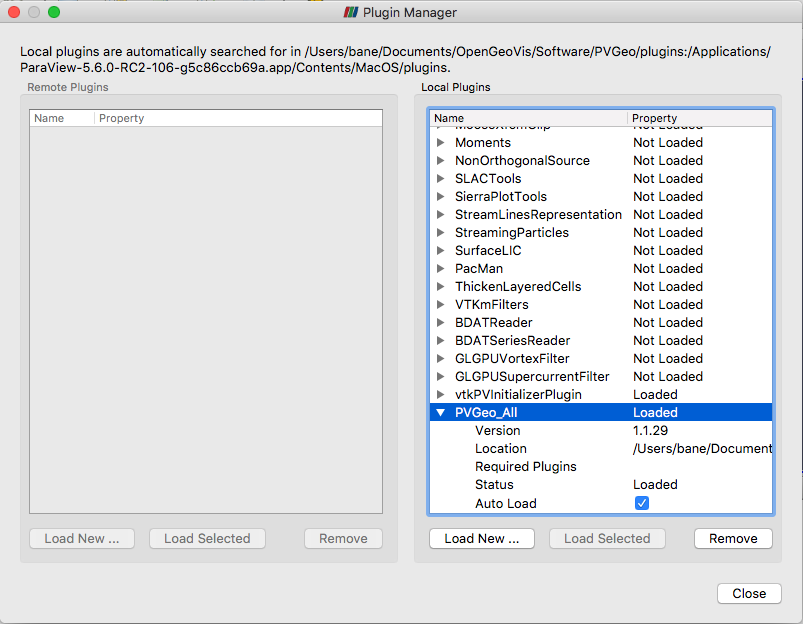

!!! info
    There are two ways you can use PVGeo: in any standard Python 2 or 3
    environment or directly in ParaView through the graphical user interface.
    Be sure to follow the installation instructions for your use case.


## Using PVGeo in a Python Environment

If you'd like to use PVGeo in Python (2.7 or 3.x) without ParaView then simply
install PVGeo to your active Python environment:

Install PVGeo via [**pip**](https://pypi.org/project/PVGeo/):
```bash
pip install PVGeo
```

??? bug "Having trouble installing VTK?"
    VTK should be installed along side PVGeo:
    On Mac and Linux, VTK is available via `pip` regardless of your
    Python version and the build script will automatically add it.
    However, Windows can be tricky as the C++ backend of VTK has
    dependencies that are not compatible with Python 2.x on Windows.

    For simplicity, try Python 3.6 and install VTK from anaconda
    before installing PVGeo:

    ```bash
    conda install vtk
    ```


??? info "Optional dependencies for more features"
    PVGeo has a few non-required dependencies that enable more algorithms and
    features when available. All requirements can be found in the
    [`requirements.txt`](https://github.com/OpenGeoVis/PVGeo/blob/master/requirements.txt)
    file in the repo but the needed requirements for PVGeo to work will be installed
    with PVGeo. Some useful dependencies:

    - [`discretize`](https://pypi.org/project/discretize/): Adds algorithms that harnesses `discretize`'s finite volume code and file IO methods.
    - [`pyproj`](https://pypi.org/project/pyproj/): Adds algorithms that can perform coordinate transformations


-----

## Using PVGeo in ParaView

If you'd like to use PVGeo directly in ParaView's graphical user interface,
you must follow the remaining steps in this section very carefully which set up
an isolated Python 2.7 environment that will be shared with your installation of
ParaView. Note that after you create this environment, you should leave it alone
and install PVGeo using the steps in [the section above](#using-pvgeo-in-a-python-environment)
for the Python environments you use everyday.

### A Brief Introduction to ParaView

ParaView is an open-source platform that can visualize 2D, 3D, and 4D
(time-varying) datasets. ParaView can process multiple very large data sets in
parallel then later collect the results to yield a responsive graphics
environment with which a user can interact. The better the processor and
graphics hardware the machine or machines hosting the software, the faster
and better ParaView will run. However, it can run quite well on a laptop
with a standard graphics card such as a MacBook Pro.

Since ParaView is an open source application, anyone can download the program
and its source code for modifications. The easiest way to get started with
ParaView is to download the compiled binary installers for your operating
system from [**here**](https://www.paraview.org/download/).

For further help, check out the [documentation](https://www.paraview.org/documentation/)
provided by Kitware. In particular, the two worth looking through for a quick
tour of ParaView are the **The ParaView Guide** and **The ParaView Tutorial.**
One is a tutorial of the ParaView software and shows the user how to create
sources, apply filters, and more. The other is a guide on how to do scripting,
macros, and more intense use of the application.

### Install ParaView

Open the downloaded installer from
[**ParaView's website**](https://www.paraview.org/download/) for ParaView 5.6.x
(or greater) and follow the prompts with the installer.

Tour around software:
Take a look at Section 2.1 of **The ParaView Tutorial** for details of the
application’s GUI environment. Chapter 2 of the tutorial as a whole does an
excellent job touring the software and its workflow for those unfamiliar with
the software and its general capabilities.


??? tip "Tip: State Files"
    One convenient feature is to save the state of the ParaView environment.
    This saves all the options you selected for all the filters you applied to
    visualize some data. Select *File->Save State…* (*Note:* this saves the
    absolute path of the files loaded into ParaView, so be sure to select
    *Search for Files Under Directory...* when opening these state files).


----------


### Install *PVGeo*

We highly recommend using Anaconda to manage your Python virtual environments, and
we know installation via Anaconda Python distributions will work on Mac, Windows,
and Linux operating systems. To begin using the *PVGeo* Python package, create
a new virtual environment and install *PVGeo* through pip.

```bash
$ conda create -n pvgeoenv python=2.7
```

??? warning "Use Python 2.7 for linking with ParaView"
    If you'd like to link PVGeo to ParaView, you must use a **Python 2.7**
    virtual environment. Once you create this 2.7 environment, you can opt to
    never use it again as it is only necessary for holding PVGeo and its
    dependencies for ParaView to use. If you'd like to use PVGeo outside of
    ParaView, any version of Python will work (except Python 2.x on Windows).


```bash
$ source activate pvgeoenv
(pvgeoenv) $ pip install PVGeo
```

#### Non-Windows Users

Now you must install VTK to your virtual environment. For Linux and Mac users,
simply install VTK through `pip`:

```bash
# Now install VTK
(pvgeoenv) $ pip install vtk
```

??? hint "Why not on Windows"
    If you are installing PVGeo for use in ParaView, the VTK Python package is
    available under the ParaView installation and PVGeo will use that library.
    Otherwise, if you'd like to use PVGeo on Windows outside of ParaView, you
    must use a Python 3.x version and install VTK through `conda` or `pip`.


### Install PVGeo to ParaView

!!! warning "Use the latest release of ParaView"
    PVGeo is compatible only with version 5.6.x (and higher) of ParaView.
    You can find the ParaView downloads page [here](https://www.paraview.org/download/)

To use the *PVGeo* library as plugins in ParaView, we must link the virtual
environment that you installed *PVGeo* to ParaView's Python environment and
load a series of plugin files that wrap the *PVGeo* code base with ParaView's
Graphical User Interface.


### Linking *PVGeo*

First, let's link *PVGeo*'s virtual environment to ParaView by setting up a
`PYTHONPATH` and a `PV_PLUGIN_PATH` environmental variables. First, retrieve
the needed paths from *PVGeo*. Do this by executing the following from your
command line:

```bash
(pvgeoenv) $ python -m PVGeo install
```

??? bug "Having Trouble?"
    Try executing the following command to debug the launcher creation
    (this will help us if you create an issue):

    ```bash
    (pvgeoenv) $ python -m PVGeo install echo
    ```

#### Mac OS Users

The above script will output the paths you need to set in the environmental variables
moving forward. If you are on a Mac OS X computer, then that script will output
a shell command for you to execute for the install. If you are on a Mac, run
that command and skip to [Loading the Plugins](#loading-the-plugins)

#### Windows Users

Setting up environmental variables is a bit involved for Windows. Remember how
we ran `:::bash python -m PVGeo install`? Well this created a new file on your
Desktop called `PVGeoLauncher.bat`. We will use this file to safely launch
ParaView it is own environment with environmental variables appropriately set.

1. Go to your Desktop and right-click to select **New->Shortcut**.

2. **Browse...** to the `PVGeoLauncher.bat` on your Desktop. Not sure where
this file is? Check the output of the `install` command from above.

3. Click **Next** and give your shortcut a meaningful name like
**ParaView+PVGeo** and select **Finish**.

4. Now right-click that newly created shortcut and select **Properties**.

5. For the **Start in** field, we will use the path to your ParaView installation
(top-level). To discover this, go to where ParaView is installed. Likely in
`C:\Program Files` and find the `ParaView 5.6-xxxxxx` folder. Go into that
folder and then copy the full path by copying the path in the navigation bar at
the top of the window. Paste this path into the **Start in** field.

6. Click **Apply** then **Okay**

7. Now launch ParaView using your new shortcut!

6. Test that the install worked: open the **Python Shell** and import the modules
delivered in this repo by executing `import PVGeo` and `import pvmacros`.
Errors should not arise but if they do, seek help via
[the Slack community](http://slack.pvgeo.org)!

### Loading the Plugins

Now you must load the plugin files through ParaView's Plugin Manager. Select
*Tools -> Manage Plugins* then select *Load New* on the bottom right of the
popup dialog. Navigate to the directory declared in `PV_PLUGIN_PATH` and load
the plugins files. Note that we have included a file called `PVGeo_All.py`;
this will load all of PVGeo's Plugins for convenience. If you wish only to load
specific suites, then load the desired suites by their individual plugin `.py`
files. Once the plugins are loaded, expand them in the plugin
manager and be sure to select *Auto Load*.

??? error "Not sure where your `PV_PLUGIN_PATH` is located?"

    Re-run the install command with an additional argument `echo`:

    ```bash
    (pvgeoenv) $ python -m PVGeo install echo
    ```

 <!-- .element width="50%" -->

Now test that the install worked by ensuring the various categories for the PVGeo
filters are in the **Filters** menu such as **PVGeo General Filters**. Errors
should not arise but if they do, post to the
[**issues page**](https://github.com/OpenGeoVis/PVGeo/issues) and the errors
will be *immediately* addressed.


!!! help
    If an error arises or you are having trouble, feel free to join the *PVGeo*
    community on Slack and ask for help:
    <script async defer src="http://slack.pvgeo.org/slackin.js"></script>

    You can also post to the
    [**issues page**](https://github.com/OpenGeoVis/PVGeo/issues) if you think
    you are encountering a bug.


### Using Outside Modules in ParaView

If you installed *PVGeo* according to the instructions above, then any Python
package installed through pip/conda in that virtual environment will be accessible in
ParaView. For some further reading on using virtual environments with ParaView,
see [this blog post](https://blog.kitware.com/using-pvpython-and-virtualenv/).


-----

## Update *PVGeo*

Use pip to update PVGeo in your python environment(s):

```bash
(pvgeoenv) $ pip install --upgrade PVGeo
```
